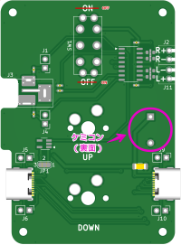

PCの音量もやっぱりMXスイッチで変えたいので、小さいオーディオアンプを作りました。

[アマゾンで売ってるスピーカーキット](https://www.amazon.co.jp/dp/B0B5Z3N3S1)や[こたつサイドなタワースピーカー](https://github.com/hidsh/kotats-side-speaker)など、ニアフィールド向けのパッシブスピーカーに最適です。

## 特徴

- お気に入りのMX互換スイッチで音量UP/DOWNできます(ソケット対応)
- 安価な「Type-Cイヤホン変換ケーブル」をDACとして直付けできます
- 電源はType-Cから取るので、ホストとの接続はType-Cケーブル1本だけでOK
- D級アンプ(3W+3W)なので、省電力
- 電源スイッチをOFFにすると、DACの接続を切断してアンプICをスリープするのでさらに省電力(約6μA)

どうせ作るならDACをいろいろ差し替えて遊びたいので、あえてキワモノっぽい仕様にしています。

雰囲気は[FAQ](#FAQ)をご覧頂き、察していただければと思います。

自作キーボードのようにGUIでキーマップを変えたりソースをいじってカスタマイズとかはできませんが、[ソルダージャンパー](#ジャンパ設定)や[リード品の抵抗器を変更](#回路定数設定)で、ある程度いじることができます。

## キットの内容

|画像|名称|数量|
|---|---|---|
||基板（部品実装済みです）|1|
||ケース（上）|1|
||ケース（下）|1|
||M2 8mm なべ小ねじ|4|

ケースは3Dプリント品（PLA）です。

## キット以外に必要なパーツ

|名称|数量|例 / 参考|
|---|---|---|
|Type-Cイヤホン変換ケーブル|1|[FAQ: Type-Cイヤホン変換ケーブルはどれでも使えるのか？](#Type-C変換ケーブルはどれでも使えるのか？)|
|Type-Cケーブル|1|[USBケーブル 5m カメラ接続用L字USBケーブル ケーブル USB 3.2 Gen1 Type C 充電データ転送コード USB Type C ケーブル 5Gbps/3A PD対応 USB-C to USB-C 長い 高耐久ナイロン 充電コード タイプc グレー](https://www.amazon.co.jp/dp/B08NP2YN7N) など|
|スピーカー|2|[FAQ: スピーカーは何ワットくらい？](#スピーカーは何ワットくらい？)|
|スピーカーケーブル|適宜|AWG26～18 ([ＶＦＦ／スピーカーコード　０．３ｓｑ　５ｍ　赤黒](https://akizukidenshi.com/catalog/g/gP-06757/) など)|
|MX互換キースイッチ|2|[Gateron Jupiter Switch Banana](https://shop.yushakobo.jp/products/8299?variant=48218925269223) など|
|MX互換キーキャップ|2|[DSA PBT ブランク キーキャップ (ブラック/2個)](https://talpkeyboard.net/items/59cce9eb428f2d1e990002ed) など|

## 必要な工具など

|名称|用途|例 / 参考|
|---|---|---|
|精密ドライバー(+)|ケースのネジ止め|百均で売っているセットのNo.1など|
|精密ドライバー(ｰ)|端子台へのスピーカー結線|百均で売っているセットの軸径1.6mmなど|
|ケーブルストリッパー|スピーカー線の被覆剥き|[フジ矢(Fujiya) ワイヤーストリッパ B 型 PP323B-165](https://www.amazon.co.jp/dp/B0193A1S08) など|

## 組み立て

基板はすべて実装済みなので、ケースに入れるだけです。

1. 下ケースに基板をはめ込む
1. 上ケースをかぶせる
1. 底面からねじを締める **相手がプラスチックなので締めすぎにご注意ください**
1. キースイッチをはめる
1. キーキャップをはめる
1. 電源スイッチをOFFにしておく **すみません。基板のシルクが逆になっているので、スイッチの●印でないほうを押し込むとOFFになります**

## 接続

スピーカー線を5mmほど線剥きして、端子台につなぎます。

端子台はケースの刻印にもありますが、外側がプラス、内側がマイナスとなっています。

## 接続テスト

出荷前に検査しておりますが、不用意に大きな音を出さないためにおすすめのテスト方法を書いておきます。

最初のテストはPCにつなぐのがいいと思います。

PCで音楽を鳴らしている場合は一旦止めて、音量ボリュームも一番小さくしておきます。

あと、チェックしやすいようにWindowsならデバイスマネージャを起動しておきます。Linuxならターミナルで`lsusb`コマンドを使います。

この状態で電源をON（スイッチの●印を押す）します。

Windowsの場合はデバイスマネージャの「オーディオの入力および出力」の下にDACが表示されると成功です。Linuxの場合はもう一度`lsusb`コマンドを実行してDACが表示されると成功です。

あとは、音楽プレイヤーやYoutubeなどの音源を起動して、音量ボリュームを徐々に大きくしていくと音が出ると思います。

## 音量調整

音量は32段階に変更可能です。

押しっぱなしにすると、キーボードのようにオートリピートになります。

### 詳しい動作
電源スイッチのON/OFFに関わらず、PCに接続した時点でアンプICが通電しデフォルトの音量がセットされます。この状態から上に8段階、下に23段階に変更できます。

上が8段階しかありませんが、アンプIC内部の音量テーブルがほぼAカーブなのでそれほど不便は感じないと思います。

電源スイッチをOFFにしてもアンプICはスリープしているだけなので変更した音量は記憶されていますが、PCとの接続を切るとデフォルトの音量に戻ります。

## ジャンパ設定

### JP1

電源スイッチの挙動を切り替えます。

電源ON/OFF時のノイズが気になる場合はパターンをカットしてハンダジャンパしてください。

|Default|設定|電源スイッチの挙動|
|:---:|---|---|
|\*|1-2|OFFでアンプICをシャットダウン(スリープ)し、USB-DACの接続を切り離します。  OFF時に USB-DACへの電源が遮断されるので最も省電力(約6μA)になりますが、ONすると「ジー」というノイズが0.5秒ほど発生します。|
|  |3-2|OFFでアンプICをシャットダウン(スリープ)しますが、USB-DACとの接続は維持したままにします。  USB-DACには通電したままでアンプICだけを省電力モードにするので電源ONでノイズは発生しませんが、OFF時の消費電流はUSB-DACの消費電流のぶん多くなります。|

なお、どちらの場合もアンプIC自体の機能によりポップノイズが抑制されます。

### JP2, JP3

設置する向きに合わせて、音量UPキーとDOWNキーを入れ替えることができます。

スイッチの裏側にあります。

入れ替える場合はパターンをカットしてハンダジャンパしてください。

|Default|JP2|JP3|内容|
|:---:|---|---|---|
|\*|1-2|1-2|SW1:UP SW2:DOWN|
|  |3-2|3-2|SW1:DOWN SW2:UP|

## 回路定数設定

### J1,J4

音量が大きすぎる場合に抵抗を差し替えてアンプのゲインを調整できます。

ただし、抵抗値（アンプの入力インピーダンス）が大きくなると定常ノイズが増加する傾向があります。

|Default|値|倍率|
|:---:|---|---|
|\*|0Ω   |x8 |
|  |3.9k |x7 |
|  |10k  |x6 |
|  |15k  |x5 |
|  |27k  |x4 |
|  |47k  |x3 |
|  |82k  |x2 |
|  |200k |x1 |

抵抗はキットには含まれていませんので、ご自分で用意する必要があります。

できるだけ左右の値を合わせたいなら、このような[100本セットの金属被膜抵抗](https://akizukidenshi.com/catalog/g/gR-08550/)を買って抵抗値が近いものを選別するとよいでしょう。

### J5,J6

Type-CコネクタのCC1/CC2端子に接続するプルアップ抵抗で、USB-DACに流せる電流制限値を設定します。J5とJ6は同じ値にします。

USB-DACが認識しないときに変更すると解決できるかもしれません。

|Default|値|設定内容|
|:---:|---|---|
|\*|実装なし|USB2 (0.5A)|
|  |56k   |USB3 0.9A  |
|  |22k   |USB3 1.5A  |
|  |10k   |USB3 3.0A  |

抵抗はキットには含まれていませんので、ご自分で用意する必要があります。

### J9,J10

Type-CコネクタのCC1/CC2端子に接続するプルダウン抵抗で、USBホストに要求する電流値を設定します。R9とR10は同じ値にします。

USB-DACが認識しないときに変更すると解決できるかもしれません。

|Default|値|設定内容|
|:---:|---|---|
|\*|5.1k |USB2 (0.5A)|
|  |56k  |USB3 0.9A  |
|  |22k  |USB3 1.5A  |
|  |10k  |USB3 3.0A  |

キットには5.1kΩしか含まれていませんので、他の抵抗は別途用意する必要があります。

### 電源用コンデンサ

基板には電源パスコンとして100μのセラミックコンデンサを実装済みですが、

「オーディオは1000μF以上と決まっとんじゃい！」

といった向きのためにケミコン用のスルーホールを配置しています。

ケミコン自体はキットには含まれていませんので、別途用意する必要があります。
また、これをつけると専用ケースには収まりませんのでご注意を。

## 回路図

## ケース

|品名|ファイル|
|---|---|
|top|[case-top](3dp/mxa08-top-v53.step)|
|bottom|[case-bottom](3dp/mxa08-bottom-v53.step)|

注意：オプションの[電源用コンデンサ](#電源用コンデンサ)をつけるとこのケースに入らなくなります。

## FAQ

### Type-C変換ケーブルはどれでも使えるのか？

まず、ダイソーで110円で売られている[イヤホンジャック＋タイプＣコード（１０ｃｍ）](https://jp.daisonet.com/collections/electricity0208/products/4549131710182)には、そもそもDACが入ってない(ﾏｼﾞｶﾖ!)ので使えません。どうやら、世の中のスマホの中にはオーディオ出力をそのままType-Cコネクタに出しているものがあるらしく、これはそういうスマホ向けのケーブルらしいです。

一方、同じダイソーのケーブルでも330円の「DACチップ搭載」と明記されているやつは使えました。

では、DAC入りなら全部使えるのかというと、そのDAC(というか、USBインターフェース)にもよるのでなんとも言えません。なので、少しでも接続できる可能性を上げるために[ここ](#J5J6)と[ここ](#J9J10)でType-Cの電流設定を変更できるようにしています。

参考までに現在私が使っているものを紹介します。
|商品名|使える？|Device Manager|USBDeview|感想|購入日|
|---|---|---|---|---|---|
|[JINGHUAType-cto3.5mm イヤホンジャックアダプタ、USB-C&3.5mm オーディオアダプタ、柔軟性と広互換性があり、Macbook Air/iPad Pro/Andriod などの Type-C インタフェースを持つスマートデバイスと互換性があります。](https://www.amazon.co.jp/dp/B09MJDGRTZ)|○|||アマゾンで買いましたが、届いたものはロゴなしでした。  商品写真には「CXチップ搭載」とか「384kHz 32bit」とか書かれていますが、USBDeviewでVIDを見ると、CXチップではなくKTMicro製で、製品ラインナップからおそらく96kHz/24bit/USB2です。 なので、かなり詐欺まがいな商品ですが一応ハイレゾですし、マザボのヘッドホン端子よりもキレのある音がするのでよしとしています。|2023/11/3|
|[ＵＳＢ　ＴＹＰＥ－Ｃ変換ケーブル](https://jp.daisonet.com/products/4550480348803)|△|||ダイソーで330円で売ってるものです。  商品名には「イヤホン」とか入ってないですが、Type-Cイヤホン変換ケーブルです。USBDeviewのVIDとPIDから「AB13X USB 2.0 Heedset Adapter」とわかります。音がでかくてドンシャリです。一応音は出ますが、Type-Cコネクタ部分が熱くなるのでおすすめできません。|2023/12/30|

この類の製品は商品説明が不正確なものがあったり、購入日によって別の品種が届いたりといったカオス状態ですが、その玉石混淆の中から神変換ケーブルを探り当てるのもチープオーディオの醍醐味かもしれません。

あとこれは言わずもがなですが、3.5mmミニジャックはメスのもの(プラグでないもの)が必要です。

### iPadやAndroid機でも使えるのか？

手元にType-Cの端末がないのでなんともいえませんが、手持ちのType-C変換ケーブルでイヤホンから音が出るなら使えると思います。

### スピーカーは何ワットくらい？

おおむね、3W〜10Wくらいを想定しています。

小さすぎると音割れしたり、スピーカーが破損するおそれがあります。

逆に大きすぎると電流不足で音量が小さくなるかもしれません。

### アクティブスピーカーでも使える？

テストしてないのでなんとも・・・。

理屈では使えなくはないと思いますが、パワーアンプが2段になるのでどんな音になるかちょっと想像できません。

### ヘッドホンやイヤホンでも使える？

これもテストしてないのでなんともですが、音量によってはヘッドホンやイヤホンが壊れる可能性があるので、やめといたほうが無難です。

### キースイッチはなんでも使えるのか？

Cherry MX互換メカニカルキースイッチならOKです。スイッチの座りを良くするために固定ピン穴をキツめに設計しているので、5ピンのスイッチがおすすめです。

### キーキャップはなんでも使えるのか？

これもCherry MX互換の十字穴ならOKです。
DSAプロファイルを基準に設計していますが、SAでも使えたのでメジャーなプロファイルなら付けられると思います。

## link
- [こたつサイドなタワースピーカー](https://github.com/hidsh/kotats-side-speaker)
